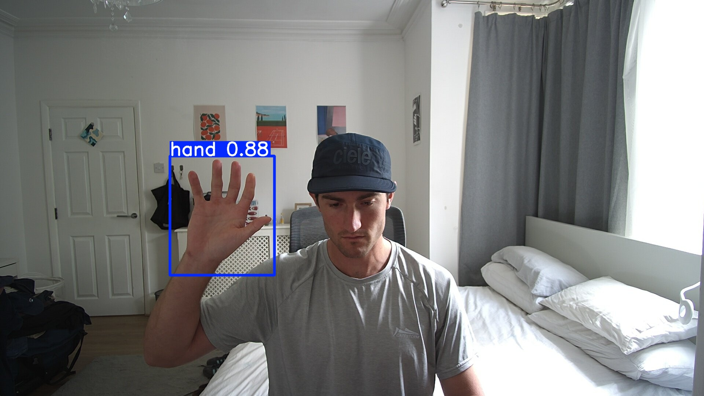
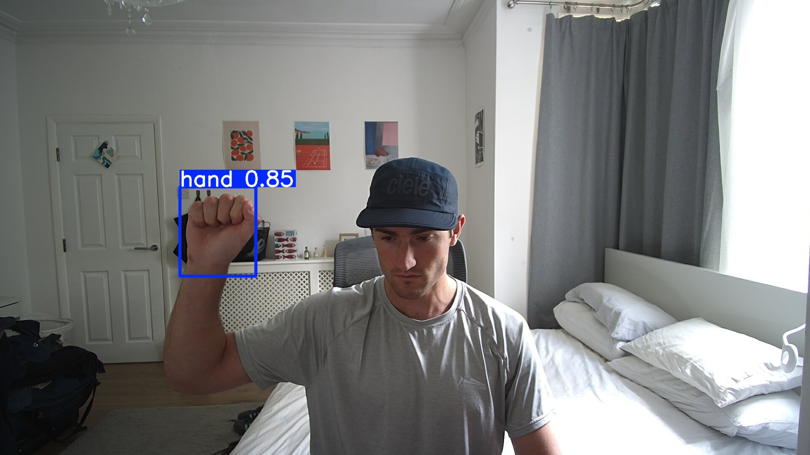
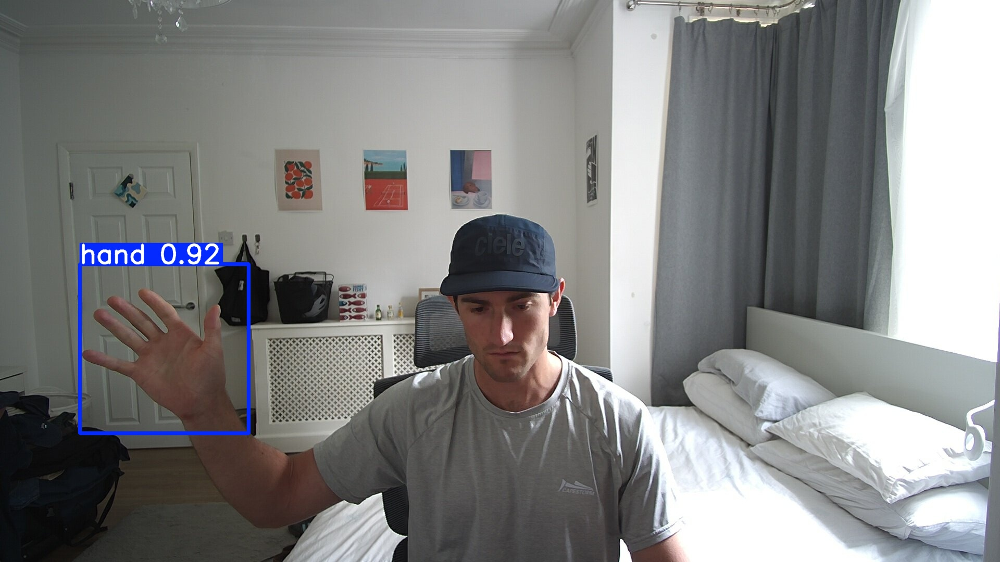

# HandDetector

This repo trains an Ultralytics YOLO11-based hand detector in Python. Trained locally on my RTX4060. I used the nano and small YOLO models as I plan on using them for real-time hand detection applications. The ONNX exports are used later in my C++ hand detection application. See: [CPP Hand Detector](https://github.com/Michael-Millard/HandDetectorCPP). It's also used in my SpinningGlobeAR app: [SpinningGlobeAR](https://github.com/Michael-Millard/SpinningEarthAR).

<div style="display: flex; gap: 10px;">
	
	
	
</div>

## Dataset

This project uses the "Hand Detection Dataset (VOC/YOLO Format)" by Nouman Ahsan, available on Kaggle: [Hand Detection Dataset](https://www.kaggle.com/datasets/nomihsa965/hand-detection-dataset-vocyolo-format?resource=download). The dataset contains labeled images for training, validation, and testing in YOLO format. A big thanks to Nouman for creating the dataset! The format of the data was modified to match the expected YOLO dataset structure.

## Repository Layout

```
.
├── main.py                   # train/val/predict entrypoint
├── yolo_models/             # directory for YOLO models (e.g., yolo11n.pt, yolo11s.pt)
├── config/
│   └── hand.yaml             # dataset config (points to ./data)
└── data/
     ├── train/
     │   ├── images/
     │   └── labels/
     ├── val/
     │   ├── images/
     │   └── labels/
     └── test/
         ├── images/
         └── labels/
```

Each image must have a same-named `*.txt` label file in `labels/...` with YOLO format lines:

`class_id cx cy w h` in normalized [0,1], where `class_id` is `0` for `hand`.

## Environment Setup

Python 3.9–3.11 recommended. This project was developed using Python 3.11.

```
python3.x -m venv .millhand-venv
source .millhand-venv/bin/activate
pip install --upgrade pip
pip install ultralytics
```

Optional but helpful: `pip install opencv-python tqdm numpy`.

## CLI Usage

### Train (YOLO11)

```
python main.py --train --epochs 50 --img 640 --batch 16 --model yolo_models/yolo11s.pt
```

Artifacts go to `output/yolo11_hand/`. Best weights: `output/yolo11_hand/weights/best.pt`.

### Validate

```
python main.py --val --model output/yolo11_hand/weights/best.pt
```

### Predict

```
python main.py --predict path/to/image_or_dir_or_video.mp4 --model output/yolo11_hand/weights/best.pt --img 640
```

### Export to ONNX for OpenCV DNN (YOLO11)

Recommended defaults for OpenCV DNN: opset 12 or 13, static input size, FP32.

```
python main.py --export --img 640 --opset 12 --model output/yolo11_hand/weights/best.pt
```

This will export from `output/yolo11_hand/weights/best.pt` if present, otherwise from `yolo_models/yolo11s.pt`. Output is typically `best.onnx` in the same folder as the weights.

Notes:
- Keep `--dynamic` off for static shapes; OpenCV handles static best.
- Keep `--half` off (FP32) unless your OpenCV build supports FP16.
- You can try `--simplify` if you have `onnxsim` installed.
